# GovConnect Frontend

GovConnect is a responsive, role-aware React frontend for a Government Service
Request Platform. It gives citizens, service agents, and administrators focused
workspaces while keeping API communication, authentication, and error handling
behind a small shared client.

> **Project status:** functional assessment/MVP. The main role journeys are
> implemented; production hardening and automated delivery work remain. See
> [Engineering maturity roadmap](#engineering-maturity-roadmap).

## Contents

- [Product overview](#product-overview)
- [Screenshots](#screenshots)
- [Architecture](#architecture)
- [Role capabilities](#role-capabilities)
- [Technology](#technology)
- [Getting started](#getting-started)
- [Quality checks](#quality-checks)
- [Project structure](#project-structure)
- [Security and constraints](#security-and-current-constraints)
- [Engineering maturity roadmap](#engineering-maturity-roadmap)
- [Documentation](#documentation)

## Product overview

The application supports the service-request lifecycle from citizen submission
through agent review and administrative oversight.

- Public citizen registration and JWT login
- Session restoration through `GET /api/auth/me`
- Role-based navigation and route guards
- Service-request submission, filtering, pagination, detail editing, and status
  processing
- Supporting-document upload and verification
- Citizen notifications and read-state management
- Citizen directory management and privileged-user creation
- Normalized API errors, loading and empty states, responsive navigation, and
  backend health visibility

## Screenshots

### Authentication

| Sign in | Citizen registration |
|---|---|
| 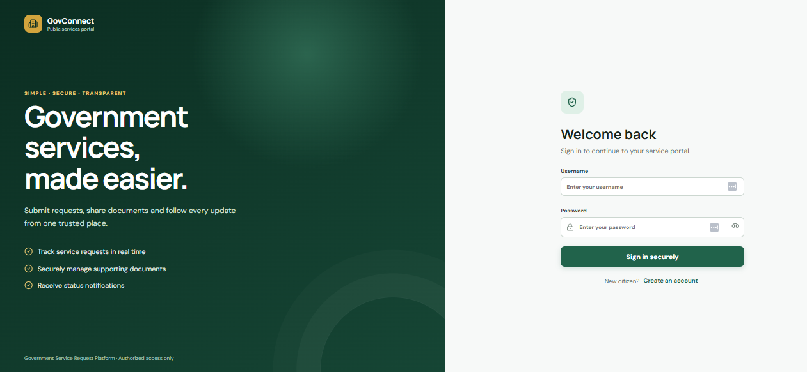 | 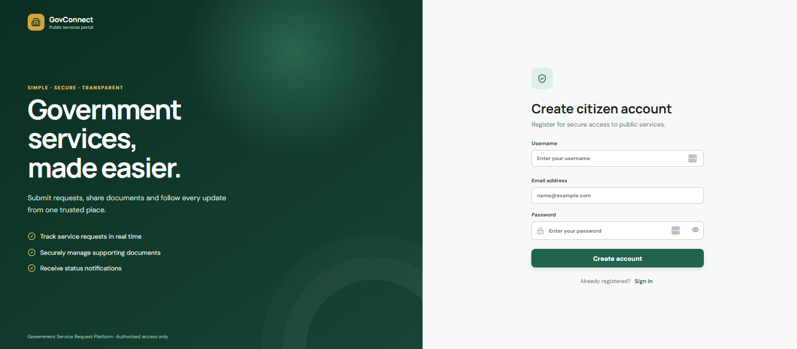 |

### Service agent workspace

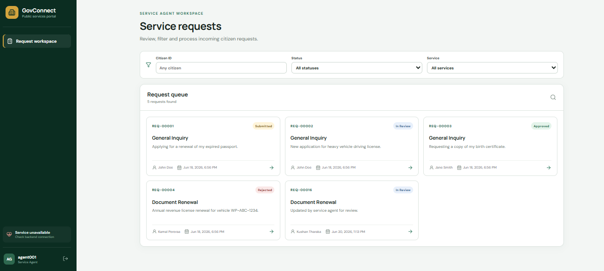

<details>
<summary>Request review, document verification, and status processing</summary>

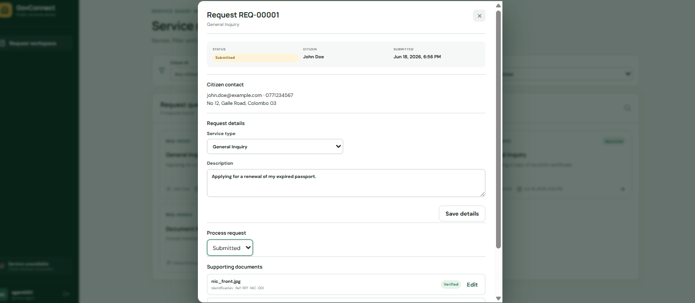

</details>

### Administrator workspace

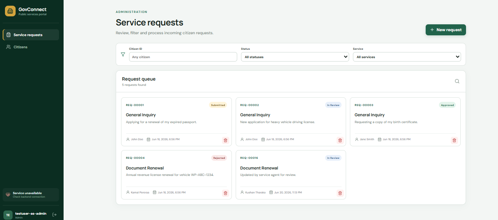

| Citizen management | Submit on behalf of a citizen |
|---|---|
| 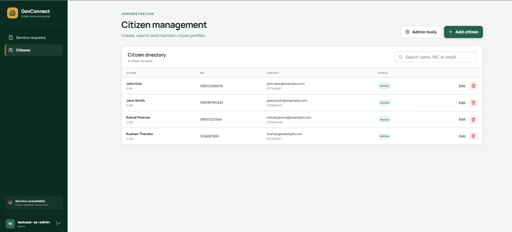 | 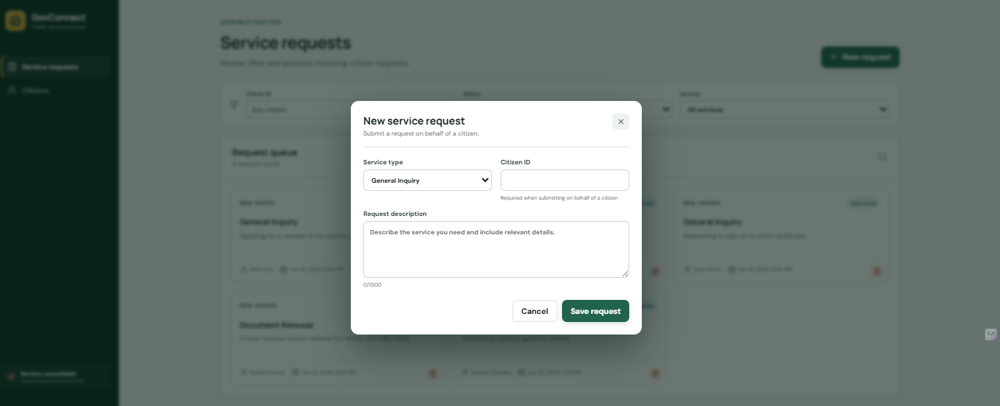 |

## Architecture

### System context

The frontend is designed for same-origin production hosting: a reverse proxy
serves the static React application and forwards API traffic to Spring Boot.
The Vite development server provides the same routing shape locally.

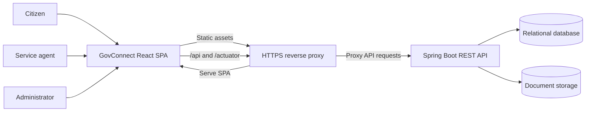

### Frontend component flow

Pages own workflow-specific state. Shared authentication state lives in React
Context, and all HTTP concerns are centralized in the API client. Backend
authorization remains authoritative; frontend route guards are a UX boundary,
not a security boundary.

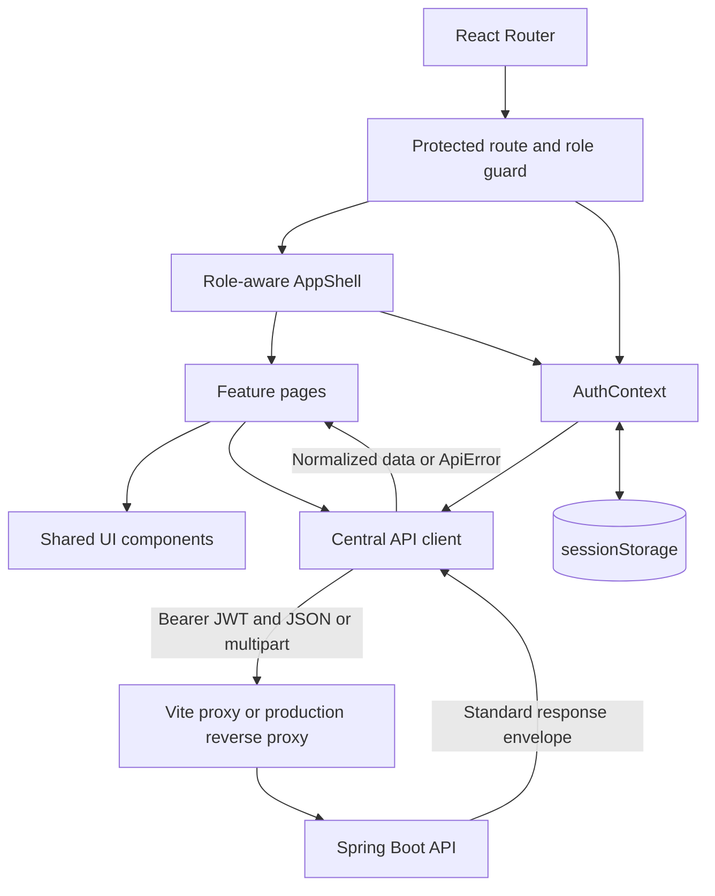

### Authentication and session restoration

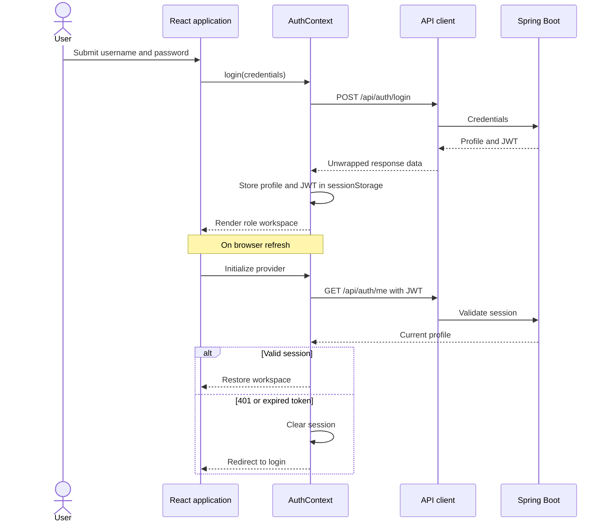

### Request lifecycle and ownership

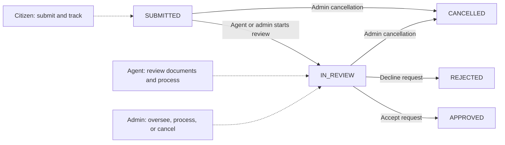

The diagram describes the UI's supported statuses. The backend must enforce the
legal transition rules.

## Role capabilities

| Capability | Citizen | Service agent | Administrator |
|---|:---:|:---:|:---:|
| Register and sign in | Yes | Sign in | Sign in |
| Submit a service request | Own | — | On behalf of citizen |
| View request queue | Own requests | Assigned/global queue | Global queue |
| Filter and process requests | — | Yes | Yes |
| Upload supporting documents | Yes | — | — |
| Review document metadata | — | Yes | By known document ID only |
| Verify documents | — | Yes | — |
| View status history | — | Yes | — |
| Receive notifications | Yes | — | — |
| Manage citizens | — | Read request-linked profile | Full management |
| Create agent/admin accounts | — | — | Yes |
| Cancel requests | — | — | Yes |

## Technology

- React and React DOM
- Vite
- React Router
- Lucide React icons
- Plain CSS design system
- Vitest, Testing Library, and jsdom
- ESLint

The current codebase uses JavaScript. TypeScript is a recommended hardening
step once API contracts are stable; it is not required merely for appearance.

## Getting started

### Prerequisites

- Node.js 20 or newer
- npm 10 or newer
- Java 21 and the backend prerequisites documented in
  `../SSE_Application_Development/README.md`

### 1. Start the backend

From the sibling `SSE_Application_Development` repository, configure its
environment and start Spring Boot:

```powershell
$env:DB_URL="jdbc:mysql://localhost:3306/gsrp_db?createDatabaseIfNotExist=true&useSSL=false&serverTimezone=UTC"
$env:DB_USERNAME="root"
$env:DB_PASSWORD="your-password"
$env:JWT_SECRET="replace-with-a-secret-of-at-least-32-characters"
.\mvnw.cmd spring-boot:run
```

Confirm the API is healthy at `http://localhost:8080/actuator/health`.

### 2. Install and configure the frontend

```powershell
npm install
Copy-Item .env.example .env.local
```

For local development, leave `VITE_API_BASE_URL` empty. Vite proxies `/api` and
`/actuator` to `http://localhost:8080`.

For a separately hosted API, set its origin:

```dotenv
VITE_API_BASE_URL=https://api.example.gov
```

The backend must then use a strict CORS allowlist for the frontend origin.

### 3. Run the application

```powershell
npm run dev
```

Open `http://localhost:5173`.

### 4. Provision users

- **Citizen:** use public registration, then sign in.
- **Service agent:** an administrator creates the account through **Admin tools**.
- **Administrator:** provision the first administrator using the backend's
  documented bootstrap or out-of-band process.

## Quality checks

```powershell
npm run lint
npm test
npm run build
npm run preview
```

`npm run build` writes production assets to `dist/`. The repository currently
has API-client unit tests; it does not yet have component, accessibility,
integration, or end-to-end coverage.

## Project structure

```text
.
├── docs/
│   ├── images/                 Product screenshots
│   ├── API-INTEGRATION.md      Endpoint-to-UI mapping
│   ├── ARCHITECTURE.md         Architecture decisions
│   └── LLM-IMPLEMENTATION-PROMPT.md
├── src/
│   ├── api/                    API client, endpoint functions, and tests
│   ├── components/             Shared shell, cards, fields, and modals
│   ├── context/                Authentication and session state
│   ├── pages/                  Role-oriented workflows
│   ├── App.jsx                 Routes and authorization gates
│   ├── constants.js            Roles, statuses, types, and formatters
│   ├── main.jsx                Application composition
│   └── styles.css              Responsive design system
├── .env.example
├── TODO.md
├── vite.config.js
└── package.json
```

## Security and current constraints

- JWT data is in `sessionStorage`. This limits persistence but does not protect
  tokens from XSS. A production design should evaluate secure, `HttpOnly`,
  `SameSite` cookies and CSRF controls with the backend team.
- The API has no refresh-token flow. Invalid or expired sessions return to the
  login screen.
- Client-side role guards improve navigation but never replace backend
  authorization.
- Production requires HTTPS, a restrictive Content Security Policy, secure
  headers, dependency scanning, and validated upload limits/types.
- An administrator can delete a document only by exact ID because there is no
  admin document-list endpoint.
- Service types are currently `GENERAL_INQUIRY` and `DOCUMENT_RENEWAL`.
- The backend exposes document metadata but no binary preview/download endpoint.
- Cross-origin deployment requires explicit backend CORS configuration;
  same-origin reverse proxying is preferred.

## Engineering maturity roadmap

This repository demonstrates good application-level fundamentals: role-based
workflows, centralized API behavior, documented backend constraints, reusable
UI primitives, and responsive screens. A senior or tech-lead project is also
judged by how it manages delivery risk, change, operations, security, and team
ownership. Those capabilities are not yet fully represented here.

### P0 — establish a reliable delivery baseline

1. **Pin dependency versions.** Replace every `latest` dependency with reviewed
   versions, define the supported Node/npm versions, and automate dependency
   updates. This makes builds reproducible.
2. **Add continuous integration.** Run lockfile installation, linting, unit
   tests, a production build, dependency audit, and artifact publication on
   every pull request.
3. **Test critical journeys.** Add Playwright tests for citizen submission,
   agent review/document verification, and admin citizen/request management
   against deterministic seeded data.
4. **Expand the test pyramid.** Cover route authorization, session expiry,
   forms, validation, pagination, error recovery, and API contract edge cases.
5. **Define release operations.** Add a container or static-host deployment,
   environment promotion, smoke checks, rollback steps, and ownership/runbooks.

### P1 — harden architecture, security, and user experience

1. **Introduce typed contracts.** Generate types and a client from an OpenAPI
   contract, or migrate incrementally to TypeScript with runtime validation at
   the API boundary.
2. **Adopt server-state management.** Use TanStack Query or an equivalent only
   when cache invalidation, retries, request cancellation, and shared server
   state justify it. Keep local form/UI state local.
3. **Complete security design.** Threat-model authentication, authorization,
   uploads, XSS, CSRF, PII exposure, audit events, and privileged operations.
   Record decisions as architecture decision records (ADRs).
4. **Meet accessibility requirements.** Run automated and manual WCAG 2.2 AA
   checks, including keyboard-only, screen-reader, contrast, zoom, reduced
   motion, error announcement, and focus-management testing.
5. **Improve failure handling.** Add route-level error boundaries, safe retry
   behavior, request cancellation, offline/timeout guidance, and correlation IDs
   that support incident investigation without exposing PII.

### P2 — demonstrate tech-lead ownership

1. **Define measurable quality gates:** coverage policy, bundle budget, Web
   Vitals targets, accessibility thresholds, security severity policy, and
   release service-level objectives.
2. **Add privacy-safe observability:** frontend errors, latency, failed journey
   rates, release markers, dashboards, alerts, and an incident response runbook.
3. **Document system evolution:** ADRs, ownership boundaries, data-flow and
   threat models, API compatibility policy, deprecation strategy, and capacity
   assumptions.
4. **Design for team scale:** contribution guide, pull-request checklist,
   review standards, coding conventions, test-data strategy, and lightweight
   feature flags for controlled rollout.
5. **Validate with evidence:** publish CI status, accessibility/security reports,
   bundle analysis, E2E results, deployment topology, and a short trade-off log.

The highest-value next increment is P0 items 1–3. It converts the current
feature-complete assessment into a reproducible, regression-resistant delivery
baseline before adding more product scope.

## Suggested product additions

- Citizen request drafts, search, and richer status-history visibility
- Secure document preview/download, upload progress, and malware-scan status
- Notification preferences and accessible in-app/toast announcements
- Agent assignment, queue ownership, saved filters, and service-level timers
- Administrator audit log and bulk operations with explicit confirmation
- Configurable service catalogue and status-transition rules from the backend
- Password reset, account recovery, MFA for privileged users, and session/device
  management
- Localization, content governance, and plain-language validation for public
  service use

Product additions should follow observed user needs and API ownership decisions;
they should not take priority over the P0 quality baseline.

## Documentation

- [API integration matrix](docs/API-INTEGRATION.md)
- [Architecture decisions](docs/ARCHITECTURE.md)
- [Implementation status and definition of done](TODO.md)
- [Implementation prompt](docs/LLM-IMPLEMENTATION-PROMPT.md)

